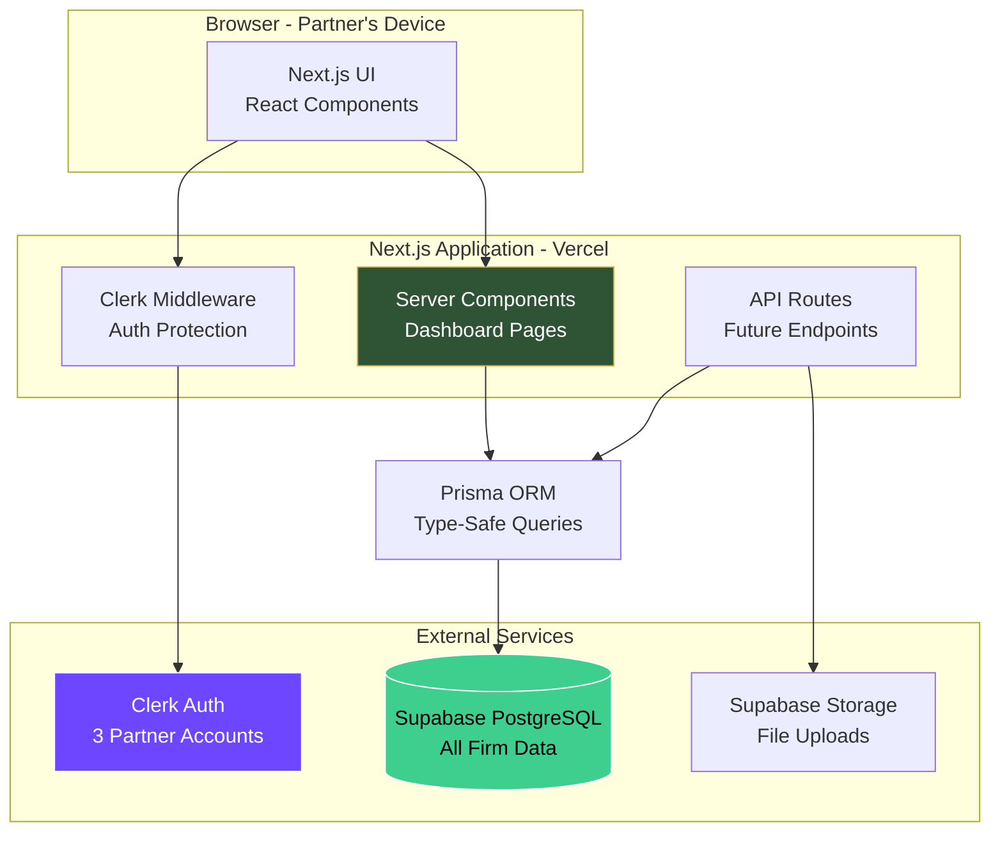
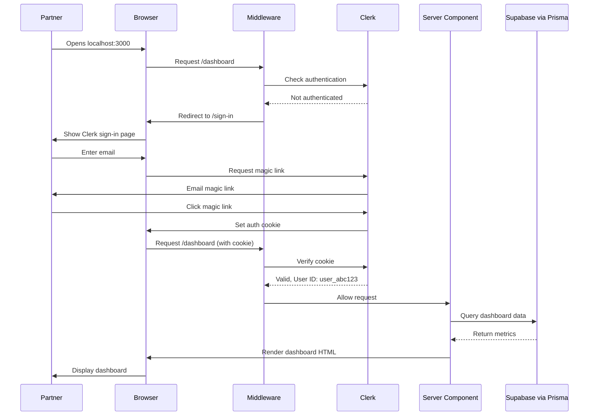
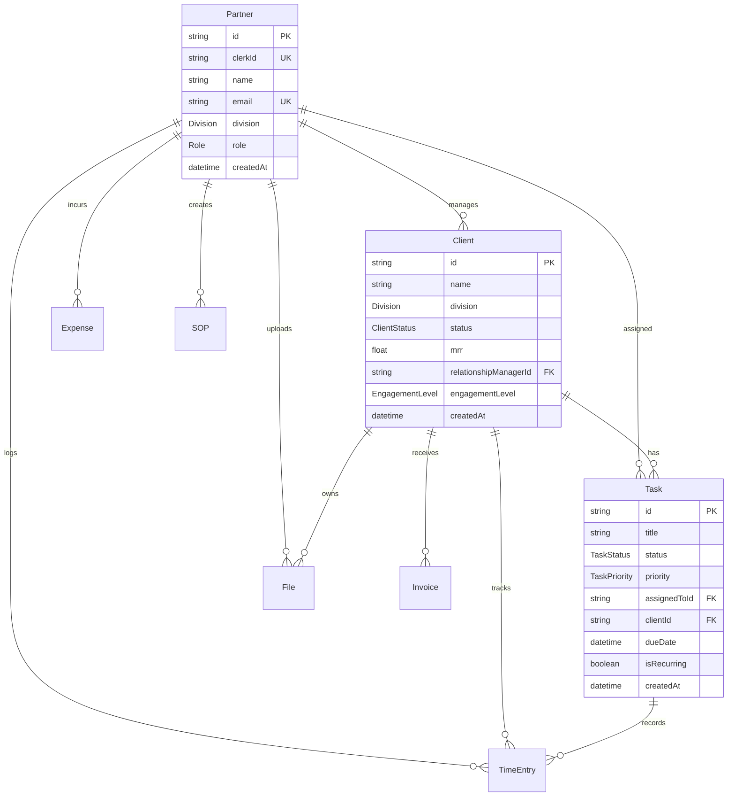
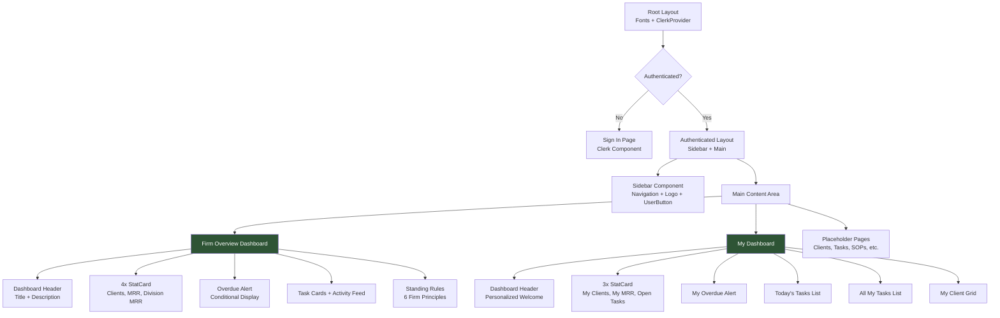
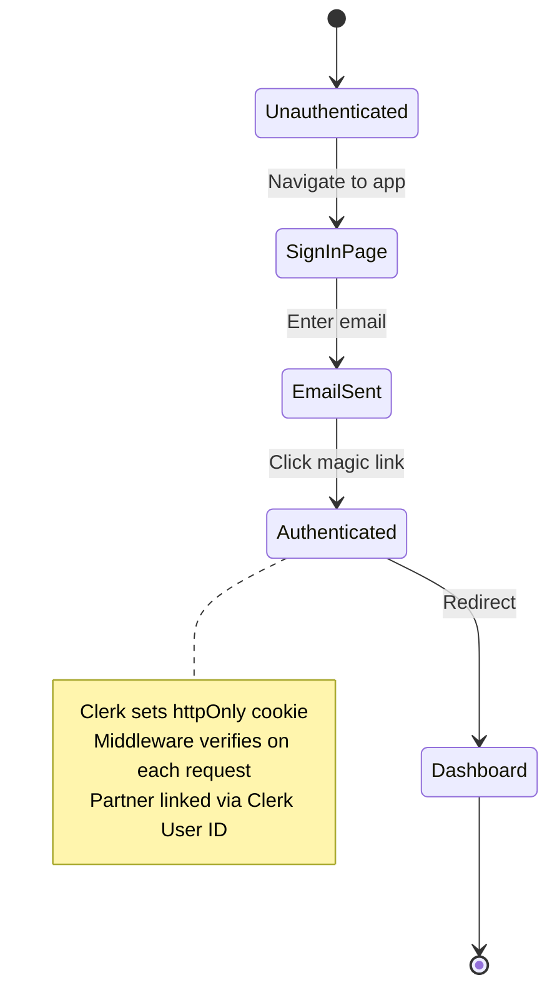
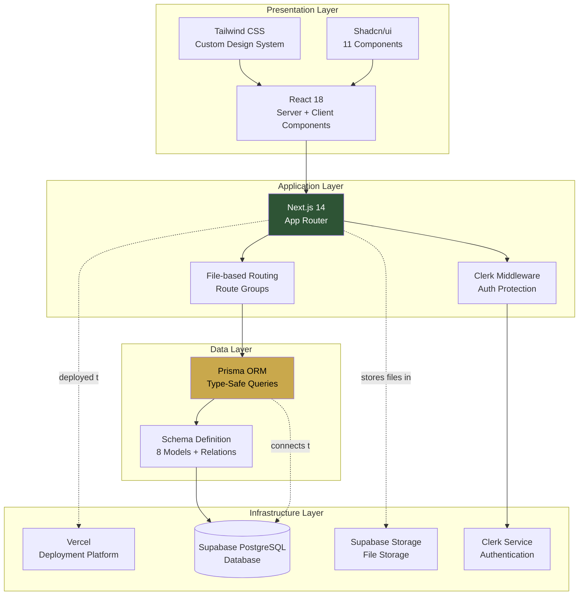
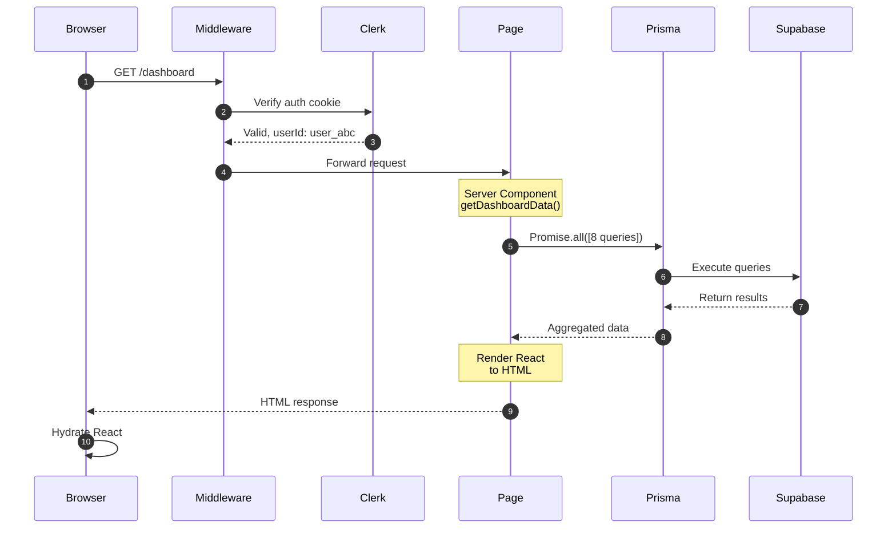
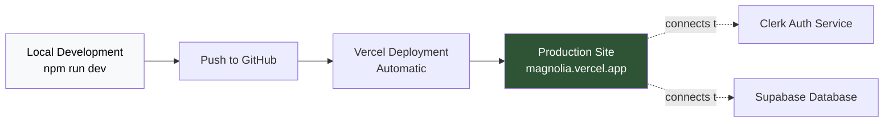

# Architecture Overview - Magnolia Advisory OS

## System Architecture



## Data Flow: Partner Sign In



## Database Schema Relationships



## Component Hierarchy



## Authentication Flow



## Dashboard Data Flow

```mermaid
graph LR
    subgraph page [Dashboard Page Server Component]
        GetData[getDashboardData Function]
    end
    
    subgraph queries [Parallel Prisma Queries]
        Q1[Count Total Clients]
        Q2[Count Active Clients]
        Q3[Sum Active MRR]
        Q4[Sum Accounting MRR]
        Q5[Sum BizDev MRR]
        Q6[Count Overdue Tasks]
        Q7[Find Tasks This Week]
        Q8[Find Recent Activity]
    end
    
    subgraph db [(Supabase)]
        Tables[Partners<br/>Clients<br/>Tasks<br/>Invoices]
    end
    
    GetData --> Q1 & Q2 & Q3 & Q4 & Q5 & Q6 & Q7 & Q8
    Q1 & Q2 & Q3 & Q4 & Q5 & Q6 & Q7 & Q8 --> Tables
    Tables --> GetData
    GetData --> Render[Render Dashboard<br/>with Data]
    
    style GetData fill:#2E5435,color:#fff
    style Render fill:#C9A84C,color:#000
```

## Tech Stack Layers



## Request Lifecycle



## Folder Structure

```
/app
  /(authenticated)         ← Route group with layout
    /dashboard
      page.tsx            ← Firm overview
      /my-dashboard
        page.tsx          ← Personal view
    /clients
    /tasks
    /sops
    /financials
    /files
    /settings
    layout.tsx            ← Sidebar wrapper
  /sign-in/[[...]]        ← Catch-all Clerk route
  /sign-up/[[...]]        ← Catch-all Clerk route
  layout.tsx              ← Root layout
  globals.css             ← Global styles
  page.tsx                ← Redirects to /dashboard

/components
  /ui                     ← Shadcn components
  sidebar.tsx             ← Navigation
  dashboard-header.tsx    ← Page headers
  stat-card.tsx           ← Metric cards

/lib
  prisma.ts               ← DB client
  utils.ts                ← Utilities

/prisma
  schema.prisma           ← Schema definition
  seed.ts                 ← Sample data
```

## Environment Variables

```
Clerk:
- NEXT_PUBLIC_CLERK_PUBLISHABLE_KEY  (public, frontend)
- CLERK_SECRET_KEY                    (private, backend)
- NEXT_PUBLIC_CLERK_SIGN_IN_URL      (routing)
- NEXT_PUBLIC_CLERK_AFTER_SIGN_IN_URL (routing)

Supabase:
- DATABASE_URL                        (private, backend)
- NEXT_PUBLIC_SUPABASE_URL           (public, frontend)
- NEXT_PUBLIC_SUPABASE_ANON_KEY      (public, frontend)
```

## Deployment Flow



## API Routes (Ready to Build)

Future API structure:

```
/api
  /clients
    GET     - List all clients (with filters)
    POST    - Create new client
    /[id]
      GET   - Get single client
      PUT   - Update client
      DELETE - Archive client
  
  /tasks
    GET     - List tasks (with filters)
    POST    - Create task
    /[id]
      GET   - Get single task
      PUT   - Update task
      DELETE - Delete task
  
  /sops
    GET     - List SOPs
    POST    - Create SOP
    /[id]
      GET   - Get SOP with content
      PUT   - Update SOP
      DELETE - Archive SOP
  
  /invoices
    GET     - List invoices
    POST    - Generate invoice
    /[id]
      PUT   - Update status
  
  /upload
    POST    - Upload file to Supabase Storage
```

## Security Model

### Current (Foundation)
```
┌──────────────┐
│   Partner    │
│  (Any email) │
└──────┬───────┘
       │
       ▼
┌──────────────┐
│  Clerk Auth  │
│  (Verified)  │
└──────┬───────┘
       │
       ▼
┌──────────────┐
│  Middleware  │
│  (Protects)  │
└──────┬───────┘
       │
       ▼
┌──────────────┐
│  Dashboard   │
│  (Full Access)│
└──────────────┘
```

### Future (With Staff)
```
Partner Role → Full access to everything
Staff Role → Limited access (no financials)
Read-Only Role → View only, no edits
```

## Performance Targets

Based on current architecture:

| Metric | Target | Notes |
|--------|--------|-------|
| Dashboard Load | < 300ms | Server-side render + DB query |
| Navigation | < 100ms | Client-side routing |
| Task Update | < 200ms | API call + revalidation |
| Search/Filter | < 150ms | Client-side or API |
| File Upload | < 2s | Depends on file size |

## Scalability

Current design supports:
- ✅ 50+ clients without performance issues
- ✅ 500+ tasks without performance issues
- ✅ 10+ partners (when you grow)
- ✅ 1000+ files in Supabase Storage
- ✅ Multiple concurrent users

## Browser Compatibility

- Chrome 90+
- Safari 14+
- Firefox 88+
- Edge 90+

(All modern browsers with ES2020+ support)

## Mobile Responsiveness

```
Desktop (1024px+)      Tablet (768-1023px)    Mobile (< 768px)
┌──────┬─────────┐    ┌──────┬─────────┐     ┌──────────────┐
│      │         │    │      │         │     │              │
│ Side │ Content │    │ Side │ Content │     │   Content    │
│ bar  │  Area   │    │ bar  │  Area   │     │   (Sidebar   │
│      │         │    │      │         │     │   collapses) │
│      │         │    │      │         │     │              │
└──────┴─────────┘    └──────┴─────────┘     └──────────────┘
  4 columns             2 columns              1 column
```

## Tech Choices Explained

### Why Next.js?
- Server-side rendering for fast dashboards
- API routes for backend logic
- File-based routing (no config needed)
- Vercel deployment (one click)
- Best-in-class React framework

### Why Clerk?
- Magic link authentication (no password management)
- User management UI built-in
- Middleware for easy route protection
- Supports multi-tenancy (if you expand)
- Free tier supports 10,000 users

### Why Supabase?
- Full PostgreSQL (not limited NoSQL)
- Built-in file storage
- Real-time subscriptions (future feature)
- Row Level Security support
- Free tier: 500 MB database, 1 GB storage

### Why Prisma?
- Type-safe database queries
- Auto-generated types
- Migration management
- Introspection of existing databases
- Great DX with autocomplete

### Why Shadcn/ui?
- Copy-paste (you own the code)
- Fully customizable
- Built on Radix UI (accessible)
- Tailwind-based (consistent with project)
- No bloated component library

## Cost Breakdown (Monthly)

Current architecture costs:

| Service | Plan | Cost | Notes |
|---------|------|------|-------|
| Vercel | Hobby | $0 | Plenty for 3 partners |
| Supabase | Free | $0 | 500 MB DB, 1 GB storage |
| Clerk | Free | $0 | Up to 10K MAU |
| **Total** | | **$0/month** | Can scale to Pro plans later |

## Monitoring & Observability

Ready for:
- Vercel Analytics (built-in)
- Sentry (error tracking)
- Supabase Dashboard (query performance)
- Clerk Dashboard (auth metrics)

## Future Enhancements

The foundation supports:
- Real-time updates (Supabase Realtime)
- Webhooks (Clerk + Stripe)
- Email notifications (Resend)
- PDF generation (invoices, reports)
- Export to Excel
- Calendar integration
- Slack notifications

---

**Foundation Status:** ✅ Architecture is solid, scalable, and production-ready
